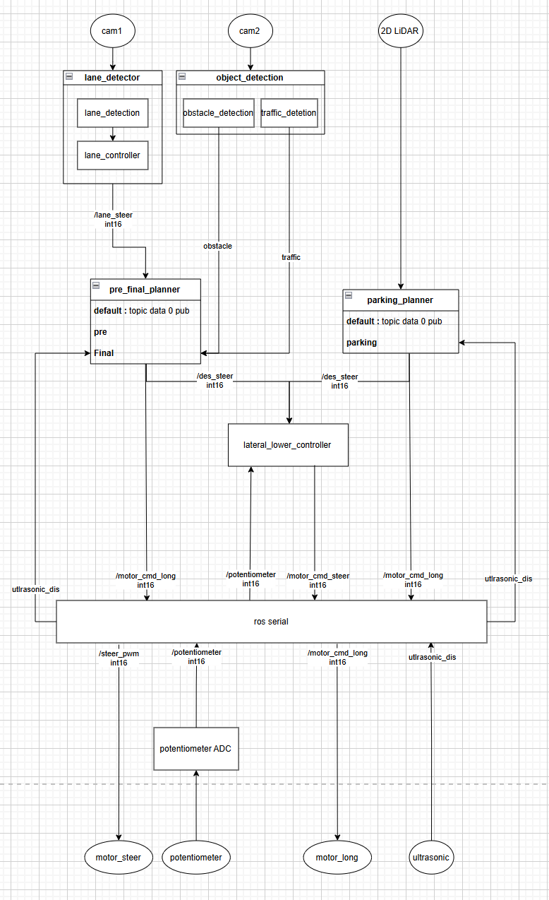

# **2026 경기도 대학생 자율주행 경진대회**
<div align="center">
  
</div>

### Team   : **AJOU NICE**
### Result :  ~ prize


| Name | developement Role |
| :--- | :--- |
| `변지훈` | aasdfasdf |
| `한민규` | aasdfasdf |
| `정민찬` | aasdfasdf |
| `구동열` | aasdfasdf |
| `전희중` | aasdfasdf |

<br>

## **Hardware Info** 

<div align="center">
  
</div>

<br>

## **System Structure**
<div align="center">
  
</div>

<br>

## **Workspace Structure**

```text
~ 
```

<br>

## Package Overview

- ### arduino_motor_bridge

- ### lane_detection
    Lane detect by OpenCV, additional filtering algorithm (DBSCAN..)

- ### laser_detection
    Detect parked cars for parking mission 

- ### lateral_controller

- ### object_detector

- ### pre_final_planner

- ### rplidar_ros
    to run rplidar's 2d lidar

- ### usb_cam
    to run logitech c920 cameras

<br>

## How to run
- ~~asdfasd

  asdfasdf
  ```shell
  asdfasdf
  ```
  

<br>

## Table

### Input table
| Name | Type | Uses |
| :--- | :--- | :--- |
| `asdf` | `asdf` | asdf |

<br>
