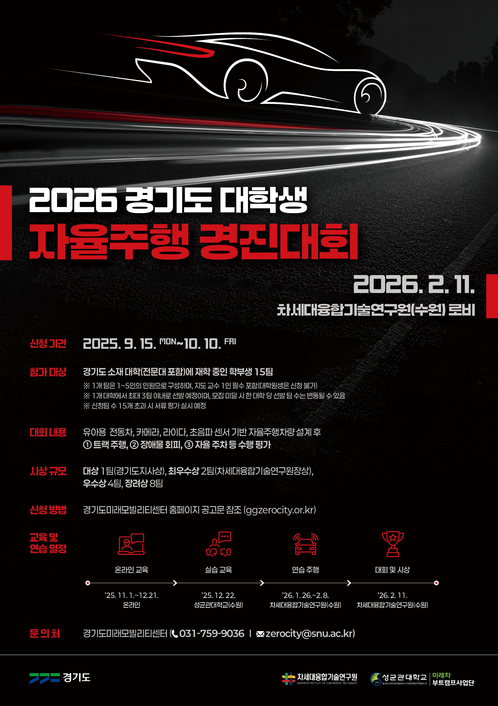
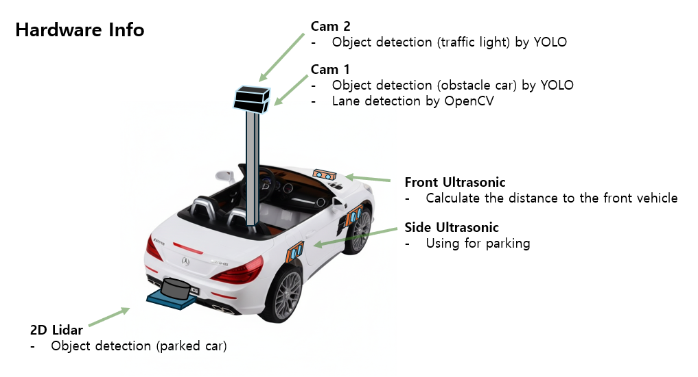
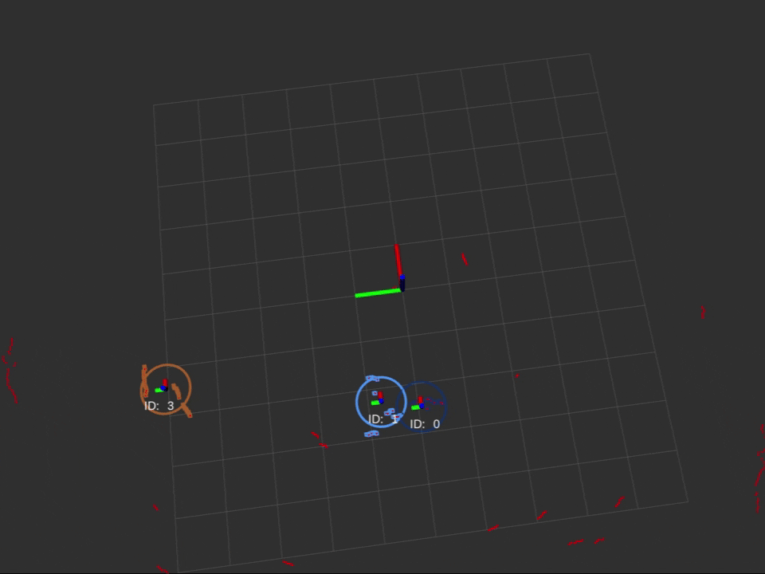
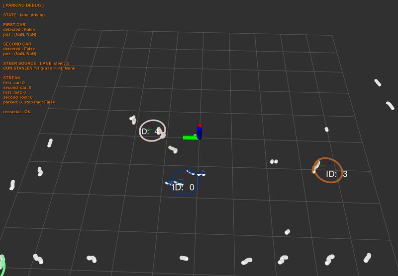

# **2026 경기도 대학생 자율주행 경진대회**

  

### Team Name   : **AJOU NICE**
###  Result :  **2nd prize** 🥈 

 

| Name | developement Role (package..) |
| :--- | :--- |
| `변지훈` | `Hardware Setting` / `lower_controller` / `pre_final_planner` / `object_detector` |
| `한민규` |  `Team leader` /  `Paper Works`  |
| `정민찬` | `lane_detection` / `laser_detector` / `object_detector (traffic)` |
| `구동열` | `parking` / `lower_controller` |
| `전희중` | `lane_detection` / `pre_final_planner` |

 

## **Hardware Info** 

  

 

## **System Structure**

  

 

## Package Overview

### For mission, system
- **arduino_motor_bridge**
    
    Arduino ROS serial bridge for motor PWM control + potentiometer/ultrasonic IO.
     
- **lane_detection**
    
    Lane detect by OpenCV, additional filtering algorithm
    Crosswalk detect by OpenCV

    

        
    

     

- **laser_detector**

    Detect parked cars by lidar (parking mission)
    

        
    
 

- **lateral_controller**
    Lower-level steering PID: /des_steer + potentiometer -> /motor_cmd_steer.
    

        
    
 
     

- **object_detector**
    YOLO car detection + ROI filter, plus 2D->ground projection for nearest car.
    YOLO traffic detection
     

- **pre_final_planner**
    Pre/Final planner modes: lane following + obstacle/traffic logic (with RViz HUD).
    

        
    
 
     

- **parking**
    Parking planner: using lane + laser detection information, FSM based planner

    

        
    

     

### For sensors
- **rplidar_ros**
    to run rplidar's 2d lidar

- **usb_cam**
    to run logitech c920 cameras

 

# Mission Vids

  

  

