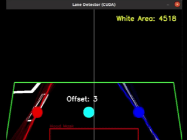
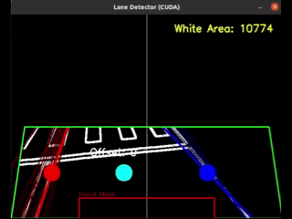
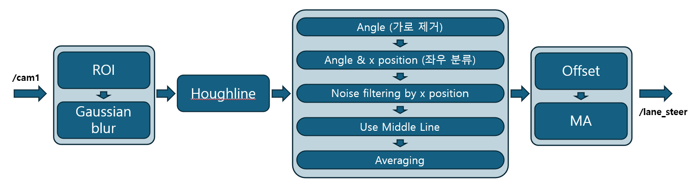

# Lane Detector

### 전방 카메라 이미지로부터 차선 정보를 추정하고 주행용 steering 입력을 생성하는 패키지

<div align="center">
  
  
</div>

## Package Role

`lane_detector` 패키지는 전방 카메라 이미지로부터 차선을 검출하고, 주행 로직이 차선 중심 추종에 사용할 수 있는 steering 및 차선 정보를 제공하는 역할을 담당한다.    
본 패키지의 핵심 책임은 이미지 입력으로부터 차선을 검출하여, `/lane_steer`, `/lane_lines_px`, `/lane_target_px`, `/crossline` topic 인터페이스로 publish하는 것이다.

## System Boundary

- 입력:
  `/cam1/usb_cam/image_raw`
- 주요 출력:
  `/lane_steer`, `/lane_lines_px`, `/lane_target_px`, `/crossline`
- 책임 범위:
  차선 후보 추정, steering 산출, crossline 판별, lane geometry publish
- 책임 범위 아님:
  최종 planner 상태 결정, 장애물 회피 판단, 저수준 steering 제어
- 상위/하위 관계:
  입력 : `usb_cam` 패키지, 출력 : `pre_final_planner` 패키지의 planner 및 visualization 노드에서 사용.

## Interface Summary

| Direction | Topic | Type | Description | Used by |
| :--- | :--- | :--- | :--- | :--- |
| Input | `/cam1/usb_cam/image_raw` | `sensor_msgs/Image` | 전방 카메라 raw image | `lane_detector` |
| Output | `/lane_steer` | `std_msgs/Int16` | 차선 기반 steering 입력 | `pre_final_planner` |
| Output | `/lane_lines_px` | `std_msgs/Int32MultiArray` | 좌/우 대표 차선 pixel line | `pre_final_planner` |
| Output | `/lane_target_px` | `geometry_msgs/PointStamped` | 목표 midpoint pixel 좌표 | `pre_final_planner` |
| Output | `/crossline` | `std_msgs/Int16` | 0 : 미검출, 1 : 검출 | `pre_final_planner` |


## Node Summary

- `run2.py`
  - 현재 `lane.launch`에서 실행되는 메인 lane detection 노드다.
  - `/lane_steer`, `/lane_lines_px`, `/lane_target_px`, `/crossline`을 중심 인터페이스로 publish한다.

## Requirements Summary

### `run2.py` node

입력 이미지 전처리 및 차선 후보 추출
- Description:
  `run2.py`는 `/cam1/usb_cam/image_raw`를 입력으로 수신하고, ROI 내부의 유효 edge와 line 후보만 후속 lane detection 처리에 사용해야 한다.
- Interface:
  Input=`/cam1/usb_cam/image_raw` (`sensor_msgs/Image`), Output=`/lane_lines_px` (`std_msgs/Int32MultiArray`)
- Verification:
  `/cam1/usb_cam/image_raw`가 포함되며, 실제로 트랙에서 주행하고 있는 bag을 사용하여 `/lane_lines_px`가 생성되는지 확인한다.
- Constraint / Fault Note:
  카메라 입력 누락, ROI 부적합, CUDA 미지원 환경에서는 차선 후보가 생성되지 않거나 노드가 종료될 수 있다.

주행용 steering 및 target 산출
- Description:
  `run2.py`는 좌우 차선 후보로부터 midpoint를 계산하고, 이를 기반으로 주행에 사용할 steering 값을 `/lane_steer`로 publish해야 한다.
- Interface:
  Output=`/lane_steer` (`std_msgs/Int16`), `/lane_target_px` (`geometry_msgs/PointStamped`)
- Verification:
  전방 카메라 rosbag replay 또는 실시간 입력에서 `/lane_steer`와 `/lane_target_px`가 연속적으로 갱신되는지 확인한다.
- Constraint / Fault Note:
  강한 조도 변화, 차선 가림 시 midpoint 추정이 흔들릴 수 있다.

결과 publish 및 crossline 상태 제공
- Description:
  `run2.py`는 차선 detection 결과와 함께 crossline 상태를 `/crossline`으로 publish해야 하며, 이미지 입력이 없을 때 새 결과를 정상 입력처럼 계속 생성하지 않아야 한다.
- Interface:
  Output=`/crossline` (`std_msgs/Int16`), `/lane_steer`, `/lane_lines_px`
- Verification:
  crossline이 포함된 전방 카메라 rosbag 또는 실시간 장면에서 `/crossline` 상태 변화를 확인하고, 입력 공백 시 새 output이 계속 갱신되지 않는지 확인한다.
- Constraint / Fault Note:
  crossline 판단은 현재 코드 내부 threshold와 queue 기반이므로 노면 밝기, 노이즈, 마스킹 조건에 따라 false detection 또는 miss detection이 발생할 수 있다.

## Verification Scenario

- 실행 준비:
  전방 카메라 실시간 입력 또는 `/cam1/usb_cam/image_raw`가 포함된 rosbag replay
- 확인 topic:
  `/lane_steer`, `/lane_lines_px`, `/lane_target_px`, `/crossline`
- 확인 방법:
  `rostopic echo`, OpenCV display window 확인

권장 bag :
- `track_1.bag`
- `track_2.bag`
- `lane_change_1.bag`
- `lane_change_2.bag`

통과 판단 기준:
- 이미지 입력이 들어오는 동안 `/lane_steer`와 `/lane_lines_px`가 생성된다.
- 실제 차선과 감지된 차선이 일치하며, 주행하며 오검출 미검출이 없다.
- 차선이 보이는 구간에서 `/lane_target_px`가 연속적으로 갱신된다.
- crossline이 포함된 장면에서 `/crossline`이 감지된다.


## Parameters

현재 `lane.launch`는 `config/setup.yaml`을 로드한다.

| Source | Name | Value | Meaning |
| :--- | :--- | :--- | :--- |
| `setup.yaml` | `output_topic` | `lane_steer` | steering 출력 topic 이름 |
| `setup.yaml` | `camera_topic` | `/cam1/usb_cam/image_raw` | 설정 파일에 정의된 camera topic |
| `setup.yaml` | `cam_mode` | `True` | 실행 모드 설정값 |
| `setup.yaml` | `video_file_name` | `curv.mp4` | mp4 기반 테스트 파일명 |
| code constant | `IMAGE_TOPIC` | `/cam1/usb_cam/image_raw` | `run2.py`가 실제로 subscribe하는 image topic |
| code constant | `window_size` | `10` | steering moving average window |
| code constant | `cross_threshold` | `13000` | crossline detection threshold |
| code constant | `position_filter_margin` | `50` | 좌/우 차선 모순 제거 margin |
| code constant | `min_lane_width` | `200` | 최소 lane width 제약 |
| code constant | steer gain | `0.18` | midpoint offset -> steering 변환 gain |

메모:
- `setup.yaml`의 `camera_topic`, `cam_mode`, `video_file_name`은 현재 `run2.py` 코드에 직접 반영되지 않는다.
- 따라서 launch/config에서 조정 가능한 값보다 코드 내부 상수의 영향이 더 크다.

## Limitations / Fault Cases

- `run2.py`는 CUDA 지원 OpenCV 환경을 전제로 하며, CUDA가 없으면 노드가 종료된다.
- 차선 가림, 그림자, 강한 조도 변화, 노면 질감 변화가 있으면 line filtering 결과가 흔들릴 수 있다.
- 한쪽 차선만 보이는 경우 기본 lane width 제약에 의존하므로 target이 실제 차선 중심과 다를 수 있다.


## Implementation Notes



### `run2.py`

1. 입력 이미지를 GPU로 업로드하고 grayscale, blur, edge 검출을 수행한다.
2. ROI를 적용해 차선 후보가 될 수 있는 영역만 남긴다.
3. CUDA 기반 Hough transform으로 직선 성분을 추출한다.
4. 기울기와 위치 기준으로 좌측/우측 차선 후보를 분리한다.
5. 대표 좌/우 차선을 계산하고 midpoint를 이용해 steering을 산출한다.
6. crossline 여부를 white pixel area 기반으로 판단해 `/crossline`을 publish한다.

memo :
- 30fps 출력을 목표로 CPU 사용으로 인한 오버헤드를 줄이기 위해 `cv2.cuda` 기반 처리를 사용한다.
- steering 출력의 high frequency를 줄이기 위해 moving average를 사용한다.
- 좌/우 차선의 물리적으로 모순되는 위치는 제거하여 대표 차선을 계산한다.
- `lane_lines_px`와 `lane_target_px`를 함께 publish해 downstream visualization과 분석이 가능하도록 한다.


## Run Guide

- 메인 lane detector 실행
  ```shell
  roslaunch lane_detector lane.launch
  ```

## ToDo

- yoloseg 모델을 기반으로 한 차선 감지 노드 제작 시도
