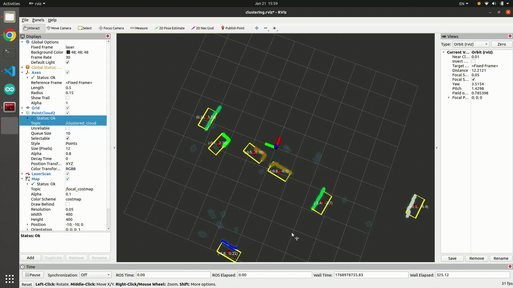

# 2D LiDAR Car Detection

2D LiDAR를 활용하여 차량을 검출하는 패키지. **Euclidean Clustering**과 **Box Fitting**을 통해 차량을 detection.

<br>

## File Structure

```text
laser_detection/
├── CMakeLists.txt
├── config
│   └── params.yaml
├── launch
│   ├── combined.launch
│   └── run.launch
├── package.xml
├── README.md
├── rviz
│   └── detection.rviz 
└── src
    ├── detection.cpp
    └── occ_grid.cpp
```

<br>

## How to run
- 각각 launch

  for publish **/scan** topic
  ```shell
  roslaunch rplidar_ros rplidar_a1.launch
  ```
  run **laser_detection** package
  ```shell
  roslaunch laser_detection run.launch
  ```
- 한번에 launch 
  ```shell
  roslaunch laser_detection combined.launch
  ```
  alias "lidar" on **vicbook**

<br>

## Topics

### Input Topic
| Name | Type | Uses |
| :--- | :--- | :--- |
| `/scan` | `sensor_msgs/LaserScan` | raw data |

### Output Topics
| Name | Type | Uses |
| :--- | :--- | :--- |
| `/local_costmap` | `nav_msgs/OccupancyGrid` | occupancy grid |
| `/clustered_cloud` | `sensor_msgs/PointCloud2` | visualization |
| `/detection_markers` | `visualization_msgs/MarkerArray` | visualization & box’s 4 point |
| `/detection_poses` | `geometry_msgs/PoseArray` | box’s center point |

<br>

## Process
1. 유클리디안 클러스터링.
2. 클러스터 내에서 두 점을 있는 가장 긴 직선의 길이를 구하고, 해당 거리 기반으로 차량으로 추정되는 클러스터를 filtering
3. 차량의 크기를 알고 있기 때문에 Box의 크기를 정해 두고 Box를 filtering된 클러스터들에 fitting

### ToDo..
- fitting 과정 중 정말 차가 아닌 것은 제거할 수 있도록. 하는 알고리즘을 추가.