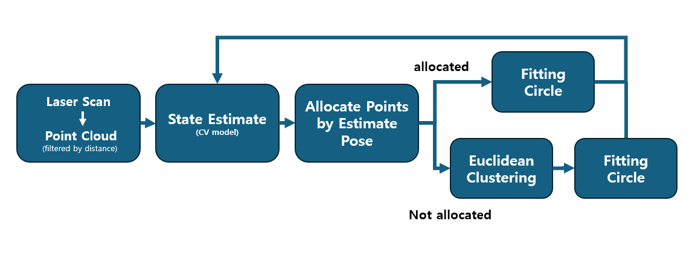

# Laser Detector

### 2D LiDAR를 이용해 주차 미션용 parked car 후보를 검출하고 추적하는 패키지


- Example: `ID 4`, `ID 6` is parked car

## System Process


## Package Role

`laser_detector` 패키지는 lidar scan으로부터 주차된 차량으로 추정되는 Object 후보를 검출하고, `parking` 패키지가 사용할 수 있는 차량의 중심 좌표를 제공하는 역할을 담당한다.  

## System Boundary

- 입력:
  `/scan`
- 주요 출력:
  `/detection_poses`, `/clustered_cloud`, `/detection_markers`, `/detection_poses_viz`
- 책임 범위:
  parked car 후보 Object 검출 및 tracking, Object의 중심 좌표 publish
- 책임 범위 아님:
  최종 주차 경로 생성, 주차 상태 판단, 차량 제어
- 상위/하위 관계:
  입력 : `rplidar_ros` 패키지, 출력 : `parking` 패키지 
## Interface Summary

| Direction | Topic | Type | Description | Used by |
| :--- | :--- | :--- | :--- | :--- |
| Input | `/scan` | `sensor_msgs/LaserScan` | raw lidar scan | `laser_detector` |
| Output | `/clustered_cloud` | `sensor_msgs/PointCloud2` | ROI 및 clustering 결과 시각화 | RViz / debug |
| Output | `/detection_markers` | `visualization_msgs/MarkerArray` | tracked object marker | RViz |
| Output | `/detection_poses` | `geometry_msgs/PoseArray` | parked car 중심 좌표 및 ID | `parking` |
| Output | `/detection_poses_viz` | `geometry_msgs/PoseArray` | visualization용 중심 좌표 | RViz |


## Requirements Summary

### `detection` node

#### 기능 요구사항

| 기능 | 설명 | Input | Output |
| :--- | :--- | :--- | :--- |
| 입력 전처리 | ROI 내부의 유효 point만 detection 처리에 사용해야 한다 | `/scan` | `/clustered_cloud` |
| parked car 후보 검출 및 추적 | 유효 point로부터 parked car 후보를 생성하고, 연속 프레임에서 동일 객체 tracking을 유지해야 한다 | `/scan` | `/detection_poses`, `/detection_markers` |
| 결과 publish 및 입력 이상 대응 | parked car 중심 좌표를 publish하고, 유효 입력이 없을 때 prediction 결과를 1초 이상 유지하지 않아야 한다 | - | `/detection_poses`, `/detection_markers`, `/detection_poses_viz` |

#### 비기능 요구사항

## Verification Scenario

- 실행 준비:
  `/scan`이 포함된 rosbag replay
- 확인 topic:
  `/clustered_cloud`, `/detection_markers`, `/detection_poses`, `/detection_poses_viz`
- 확인 방법:
  `rostopic echo`, RViz marker 확인, bag replay 중 topic 생성 여부 확인

권장 bag:
- `kkd_parking1.bag`
- `kkd_parking2.bag`
- `kkd_parking3.bag`


통과 판단 기준:
- parked car가 있는 bag에서 `/detection_poses`가 생성된다.
- 동일 parked car가 불필요하게 매 프레임 다른 ID로 바뀌지 않는다.
- 입력 공백 또는 미검출 bag에서 prediction 결과가 1초 이상 남지 않는다.
- RViz에서 `/clustered_cloud`와 `/detection_markers`를 통해 detection 결과를 확인할 수 있다.

## Parameters

주요 파라미터는 `config/params.yaml`에 정의되어 있다.

| Parameter | Value | Meaning |
| :--- | :--- | :--- |
| `cluster_tolerance` | `0.2` | clustering 시 점 사이 최대 거리 |
| `min_cluster_size` | `25` | 최소 cluster 크기 |
| `max_cluster_size` | `1000` | 최대 cluster 크기 |
| `max_cluster_extent` | `1.5` | cluster 최대 크기 제한 |
| `min_cluster_extent` | `0.3` | cluster 최소 크기 제한 |
| `use_fixed_size` | `true` | 고정 크기 기반 fitting 사용 여부 |
| `fixed_width` | `0.8` | 고정 폭 |
| `fixed_length` | `0.9` | 고정 길이 |
| `roi_min_range` | `0.25` | 최소 ROI 거리 |
| `roi_max_range` | `7.0` | 최대 ROI 거리 |
| `max_disappeared_frames` | `7` | tracking 유지 가능한 최대 미검출 프레임 수 |
| `cv_max_speed` | `0.3` | tracking용 속도 제한 |


## Limitations / Fault Cases

- clutter가 많은 환경에서는 false positive가 증가할 수 있다.
- point가 sparse한 경우 parked car 중심 추정이 흔들릴 수 있다.
- 입력 point 손실이 길어지면 track이 끊기거나 ID가 바뀔 수 있다.


## Implementation Notes



1. `/scan`을 받아 전처리(ROI) 및 `PointCloud`로 변환
2. 이전 프레임에 감지된 객체로부터 `Constant Velocity` 모델을 적용하여 예상 위치를 계산
3. 각 객체의 예상 위치 주변 point를 해당 객체에 할당
4. 할당된 point가 있으면 `Circle fitting`으로 중심 좌표를 추정
5. 할당되지 않은 나머지 point에 대해 `Euclidean Clustering` 수행

memo:
- 2D lidar는 point가 sparse하고 불안정할 수 있기 때문에, 한 번 감지한 객체를 바로 버리지 않고 tracking이 가능하도록 설계했다.
- 처음 clustering 조건에 살짝 맞지 않더라도, 기존 track 주변에 point가 남아 있으면 계속 감지할 수 있도록 구성했다.
- parking planner가 사용하는 값은 중심 좌표이므로, 본 패키지는 L-shape fitting보다 중심점 안정성에 더 초점을 둔다.

## Run Guide

- `/scan` publish
  ```shell
  roslaunch rplidar_ros rplidar_a1.launch
  ```

- detector 실행
  ```shell
  roslaunch laser_detection run.launch
  ```


## ToDo

- fitting 과정에서 차량이 아닌 객체(옷, 다리 등)를 더 잘 제거할 수 있는 filtering 로직 추가
