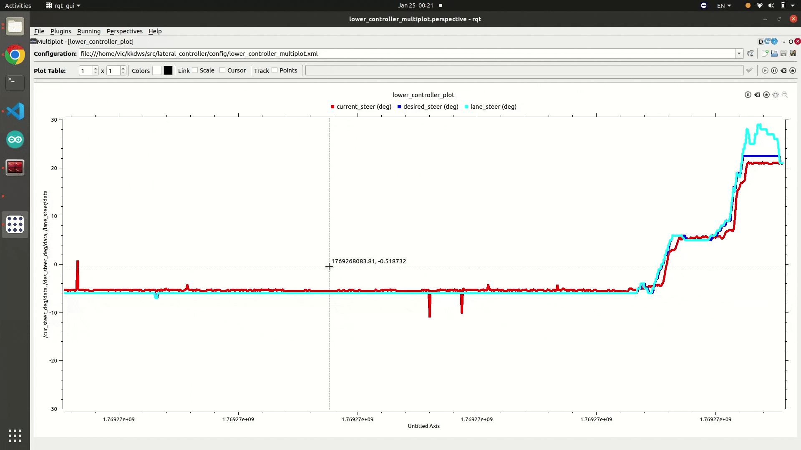

# Lateral Controller (Lower-Level Steering PID)

This package is a lower-level steering controller. It receives target steering (`/des_steer`) and steering potentiometer feedback (`/potentiometer`), then outputs motor PWM (`/motor_cmd_steer`) using PID control.

<br>

## Controller Demo


RED : current_steer(deg)
BLUE : desried_steer(deg)
MINT : lane_steer(deg)
<br>

## File Structure

```text
lateral_controller/
├── CMakeLists.txt
├── config
│   ├── lower_controller_multiplot.perspective
│   └── lower_controller_multiplot.xml
├── launch
│   ├── lateral_lower_controller.launch
│   └── lateral_lower_controller_test.launch
├── package.xml
├── README.md
└── scripts
    ├── lateral_lower_controller.py
    ├── lower_controller_test.py
    └── lower_controller_test_step.py
```

<br>

## Nodes

### `lateral_lower_controller.py`
- **Rate**: 20 Hz timer-based loop
- **Control**: PID + derivative low-pass filter + anti-windup
- **Safety**: If current steering is out of range, output is forced to 0

### `lower_controller_test.py`
- Publishes sinusoidal steering input

### `lower_controller_test_step.py`
- Publishes step steering input

<br>

## Topics

### Input Topics
| Name | Type | Uses |
| :--- | :--- | :--- |
| `/des_steer` | `std_msgs/Int16` | Target steering angle (deg) |
| `/potentiometer` | `std_msgs/Int16` | Steering potentiometer value (raw) |

### Output Topics
| Name | Type | Uses |
| :--- | :--- | :--- |
| `/motor_cmd_steer` | `std_msgs/Int16` | Steering motor PWM |
| `/des_steer_deg` | `std_msgs/Float32` | Target steering angle (deg) monitor |
| `/cur_steer_deg` | `std_msgs/Float32` | Current steering angle (deg) monitor |

<br>

## Key Constants (code)

These constants are currently hardcoded in `scripts/lateral_lower_controller.py`.

| Name | Meaning | Default |
| :--- | :--- | :--- |
| `GT_LEFT_MAX`, `GT_RIGHT_MAX` | Steering angle limits (deg) | `+22.5`, `-22.5` |
| `Kp`, `Ki`, `Kd` | PID gains | `14.0`, `0.0`, `1.0` |
| `u_max` | PWM limit | `255` |
| `MARGIN` | Safety margin (deg) | `1.5` |
| `POT_LEFT_MAX`, `POT_RIGHT_MAX` | Potentiometer range | `576`, `422` |

<br>

## How to Run

### 1) Lower controller
```shell
roslaunch lateral_controller lateral_lower_controller.launch
```

If `with_rqt:=false` is set, the rqt multiplot UI will not be launched.
```shell
roslaunch lateral_controller lateral_lower_controller.launch with_rqt:=false
```

### 2) Test input (sine / step)
The test nodes publish to **`/lane_steer`** by default.  
For real controller input, remap it to `/des_steer`.

```shell
rosrun lateral_controller lower_controller_test.py /lane_steer:=/des_steer
```

```shell
rosrun lateral_controller lower_controller_test_step.py /lane_steer:=/des_steer
```

Or edit `launch/lateral_lower_controller_test.launch` and add remap settings.

<br>

## Notes
- `/potentiometer` is converted from range `0~1023` to steering angle.
- If `out_of_range()` condition is true, PWM output is fixed to `0`.
- `POT_LEFT_MAX`, `POT_RIGHT_MAX` needs to be adjusted before every run. 