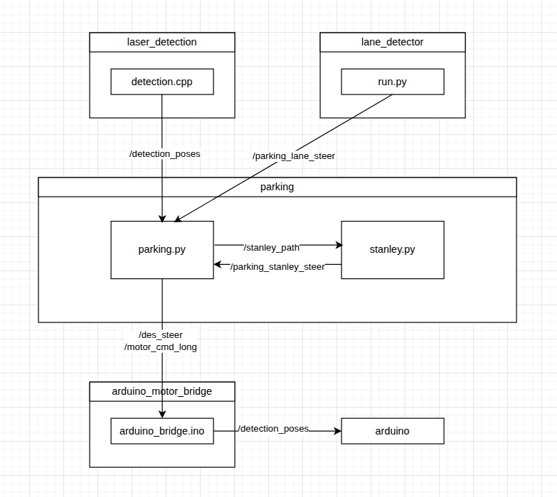

# Parking

### LiDAR, Camera를 바탕으로 parking 미션을 수행하는 FSM 기반 Planner 패키지.

<br>
- Id : 5, 7 is parked car
<br>


<br>
- 대회 당일 주행 영상
<br>


## Process

1. 


### Key Strategies
- 
- 
- 
  
## Topics

### Input Topic
| Name | Type | Uses |
| :--- | :--- | :--- |
| `/detection_poses` | `geometry_msgs/PoseArray` | 차량 정보 |
| `/parking_lane_steer` | `std_msgs/Int16` | 차선 정보 |

### Output Topics
| Name | Type | Uses |
| :--- | :--- | :--- |
| `/des_steer` | `std_msgs/Int16` | lateral steering |
| `/motor_cmd_long` | `std_msgs/Int16` | longitudinal speed |
| `/stanley_path` | `nav_msgs/Path` | parking path points |

| `/parking_viz` | `visualization_msgs/MarkerArray` | rviz debug|
| `/roi_marker` | `visualization_msgs/Marker` | rviz debug |
| `/debug_overlay_text` | `jsk_rviz_plugins/OverlayText` | rviz debug |

<br>

## File Structure

```text
parking/
├── CMakeLists.txt
├── config
│   └── parking.yaml
├── launch
│   └── combined.launch
├── package.xml
├── README.md
├── rviz
│   └── detection.rviz 
└── scripts
    ├── parking.py
    └── stanley.py

```

<br>

## How to run

- 다음 launch 파일(combinded.launch)을 통해 한번에 실행.

  Process diagram의 모든 노드 실행.

  ```shell
  <launch>

  <param name="/use_sim_time" value="false" />

  <!-- RPLIDAR-->
  <node name="rplidarNode" pkg="rplidar_ros" type="rplidarNode" output="screen">
    <param name="serial_port"      value="/dev/ttyUSB0"/>
    <param name="serial_baudrate"  value="115200"/>
    <param name="frame_id"         value="laser"/>
    <param name="inverted"         value="false"/>
    <param name="angle_compensate" value="true"/>
  </node>
  

    <!-- laser_detection -->
    <node name="detection" pkg="laser_detector" type="detection" output="screen">
        <rosparam command="load" file="$(find laser_detector)/config/params.yaml" />
    </node>

    <!-- Stanley Controller -->
    <node name="stanley" pkg="parking" type="stanley.py" output="screen" />
    
    <!-- Lane Controller-->
    <node name="run" pkg="lane_detector" type="run.py" output="screen"/>
    
    
    <!-- Parking Planner-->
    <node name="parking" pkg="parking" type="parking_new.py" output="screen">
      <rosparam command='load' file="$(find parking)/config/parking.yaml"/>
    </node>
	
    <!-- rviz -->
    <node pkg="rviz" type="rviz" name="rviz" args="-d $(find parking)/rviz/detection.rviz" />

  </launch>

  ```
  <br>
  alias "parking"
  ```shell
  code ~/.bashrc
  ```
  ```shell
  alias parking='roslaunch parking combined.launch'
  ```
  터미널에서
  ```shell
  parking
  ```