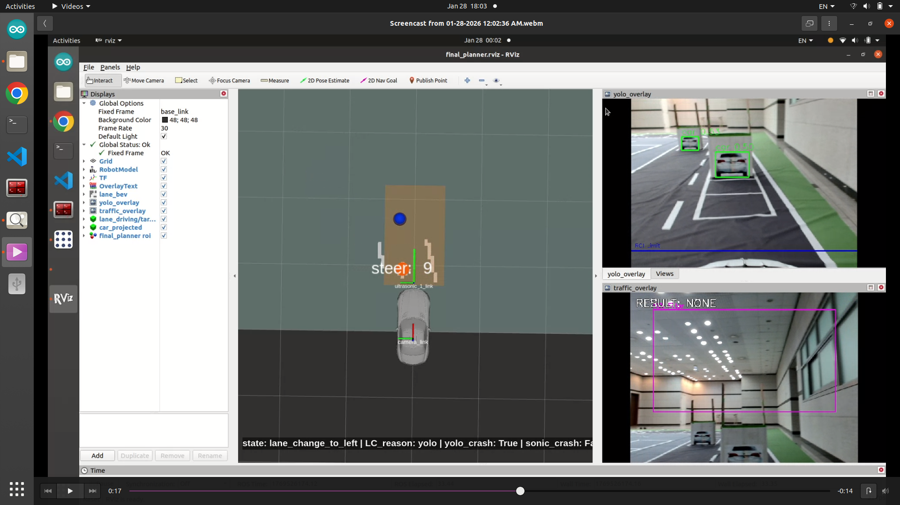

# pre_final_planner

ROS1 패키지로, **사전 주행 모드(pre)**와 **최종 주행 로직(final)**, 그리고 RViz 시각화를 묶어 제공합니다.

## 구성

```
pre_final_planner/
├─ config/
│  ├─ final_planner.yaml
│  ├─ final_planner_rviz.yaml
│  ├─ lane_bev_rviz.yaml
│  └─ setup.yaml
├─ launch/
│  ├─ pre_planner.launch
│  └─ final_planner.launch
├─ rviz/
│  └─ final_planner.rviz
└─ scripts/
   ├─ pre_planner.py
   ├─ final_planner.py
   ├─ final_planner_rviz.py
   └─ lane_bev_rviz.py
```
<br>
<div align="center">
  
</div>
<br>

## 노드 요약

### `pre_planner.py`
키보드 입력으로 **DEFAULT/PRE** 모드를 전환하며, 간단히 조향/모터 명령을 출력합니다.

- 입력
  - `/lane_steer` (std_msgs/Int16)
- 출력
  - `/des_steer` (std_msgs/Int16)
  - `/motor_cmd_long` (std_msgs/Int16)
- 키보드
  - `d`: DEFAULT (정지/기본 출력)
  - `p`: PRE (lane_steer + 고정 속도)

### `final_planner.py`
차선 주행, 장애물 회피(YOLO), 교차선/신호 대응을 포함한 **최종 주행 로직**입니다.

- 입력
  - `/lane_steer` (std_msgs/Int16)
  - `/cur_lane` (std_msgs/Int16)
  - `/car_projected` (geometry_msgs/PointStamped)
  - `/traffic` (std_msgs/Int16)
  - `/crossline` (std_msgs/Int16)
- 출력
  - `/des_steer` (std_msgs/Int16)
  - `/motor_cmd_long` (std_msgs/Int16)
  - `/final_planner/state` (std_msgs/String)
  - `/final_planner/yolo_crash` (std_msgs/Bool)
  - `/final_planner/lane_change_reason` (std_msgs/String)
- 키보드
  - `d`: DEFAULT (정지/기본 출력)
  - `f`: FINAL (최종 주행 로직 실행)

### `final_planner_rviz.py`
Final planner 상태를 **ROI/텍스트 HUD**로 시각화합니다.

- 입력
  - `/final_planner/state` (std_msgs/String)
  - `/final_planner/yolo_crash` (std_msgs/Bool)
  - `/final_planner/lane_change_reason` (std_msgs/String)
- 출력
  - `/final_planner/markers` (visualization_msgs/MarkerArray)
  - `/final_planner/hud` (jsk_rviz_plugins/OverlayText)

### `lane_bev_rviz.py`
차선 픽셀 좌표를 BEV(조감도) OccupancyGrid로 변환하여 RViz에 표시합니다.

- 입력
  - `/lane_lines_px` (std_msgs/Int32MultiArray)
  - `/lane_target_px` (geometry_msgs/PointStamped)
  - `/lane_steer` (std_msgs/Int16)
- 출력
  - `/lane_bev/grid` (nav_msgs/OccupancyGrid)
  - `/lane_bev/markers` (visualization_msgs/Marker)

## 실행 방법

### Pre 모드 노드
```
roslaunch pre_final_planner pre_planner.launch
```

### Final + RViz
```
roslaunch pre_final_planner final_planner.launch
```

## 주요 파라미터

- `config/final_planner.yaml`
  - `planner_common/roi/*`
  - `final_planner/speed_*`, `lc_steer`, `steer_time*`, `straight_time*`
  - `final_planner/*_count_threshold`, `traffic_*`
- `config/final_planner_rviz.yaml`
  - HUD/마커 표시 위치, 크기, 색상
- `config/lane_bev_rviz.yaml`
  - 카메라 내/외부 파라미터, grid 크기/해상도, 표시 스타일

## 의존성

패키지 선언: `roscpp`, `rospy`, `std_msgs`  
스크립트 사용: `geometry_msgs`, `visualization_msgs`, `nav_msgs`, `jsk_rviz_plugins`, `numpy`
