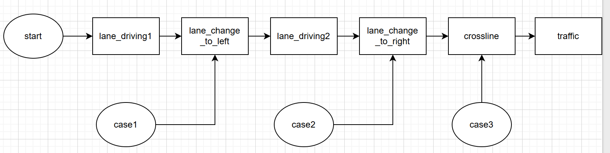

# Pre Final Planner

### PRE / FINAL 주행 상태기계와 planner 시각화 노드를 제공하는 driving logic package

## State Machine

## System Process

## Package Role

`pre_final_planner` 패키지는 lane, object, traffic, serial 상태를 입력으로 받아 PRE 주행과 FINAL 주행 모드의 상위 driving logic을 수행하고, 최종 `/des_steer`, `/motor_cmd_long` 명령과 시각화용 상태 정보를 publish 하는 역할을 담당한다.  
본 패키지의 핵심 책임은 `PRE` 모드에서 단순 lane-following 출력을 생성하고, `FINAL` 모드에서 차선 변경, 장애물 대응, crossline, traffic 대응을 포함한 주행 상태기계를 수행하는 것이다.

## System Boundary

- 입력:

  | Topic | Type | Description |
  | :--- | :--- | :--- |
  | `/lane_steer` | `std_msgs/Int16` | 차선 기반 조향 입력 |
  | `/lane_lines_px` | `std_msgs/Int32MultiArray` | 좌우 차선 pixel line |
  | `/lane_target_px` | `geometry_msgs/PointStamped` | lane target pixel |
  | `/cur_lane` | `std_msgs/Int16` | 현재 lane index |
  | `/car_projected` | `geometry_msgs/PoseArray` | planner용 장애물 위치 |
  | `/traffic` | `std_msgs/Int16` | 신호 상태 |
  | `/crossline` | `std_msgs/Int16` | crossline 검출 결과 |
  | `/rosserial_check` | `std_msgs/Int16` | rosserial link 상태 |

- 주요 출력:

  | Topic | Type | Description |
  | :--- | :--- | :--- |
  | `/des_steer` | `std_msgs/Int16` | 목표 조향각 command |
  | `/motor_cmd_long` | `std_msgs/Int16` | 종방향 PWM command |
  | `/final_planner/state` | `std_msgs/String` | FINAL state machine 상태 |
  | `/final_planner/yolo_crash` | `std_msgs/Bool` | ROI 내 장애물 감지 여부 |
  | `/final_planner/lane_change_reason` | `std_msgs/String` | 차선 변경 이유 |
  | `/final_planner/yolo_crash_point` | `geometry_msgs/PointStamped` | 최근접 장애물 위치 |
  | `/final_planner/markers` | `visualization_msgs/MarkerArray` | planner ROI / state marker |
  | `/final_planner/hud` | `jsk_rviz_plugins/OverlayText` | planner HUD overlay |
  | `/lane_bev/grid` | `nav_msgs/OccupancyGrid` | lane pixel 기반 BEV grid |
  | `/lane_bev/markers` | `visualization_msgs/Marker` | lane BEV marker |
- 책임 범위:
  PRE / FINAL mode handling, 상태기계 전이, planner level 조향/종방향 명령 생성, planner debug / RViz visualization
- 책임 범위 아님:
  저수준 steering PID, Arduino 모터 구동, camera / lidar perception 자체, 일반적인 closed-loop 종방향 제어기
- 상위/하위 관계:
  입력 : `lane_detector`, `object_detector`, `support`
  출력 : `lateral_controller`, `arduino_motor_bridge`, RViz 및 debug 확인 환경

## Interface Summary

| Direction | Topic | Type | Description | Used by |
| :--- | :--- | :--- | :--- | :--- |
| Input | `/lane_steer` | `std_msgs/Int16` | 차선 기반 조향 입력 | `pre_planner.py`, `final_planner.py`, `lane_bev_rviz.py` |
| Input | `/lane_lines_px` | `std_msgs/Int32MultiArray` | 좌우 차선 pixel line | `final_planner.py`, `lane_bev_rviz.py` |
| Input | `/lane_target_px` | `geometry_msgs/PointStamped` | lane target pixel | `lane_bev_rviz.py` |
| Input | `/cur_lane` | `std_msgs/Int16` | 현재 lane index | `final_planner.py` |
| Input | `/car_projected` | `geometry_msgs/PoseArray` | planner용 장애물 위치 | `final_planner.py` |
| Input | `/traffic` | `std_msgs/Int16` | 신호 상태 | `final_planner.py` |
| Input | `/crossline` | `std_msgs/Int16` | crossline 검출 결과 | `final_planner.py` |
| Input | `/rosserial_check` | `std_msgs/Int16` | rosserial link 상태 | `pre_planner.py`, `final_planner.py` |
| Output | `/des_steer` | `std_msgs/Int16` | 목표 조향각 command | `lateral_controller` |
| Output | `/motor_cmd_long` | `std_msgs/Int16` | 종방향 PWM command | `arduino_motor_bridge` |
| Output | `/final_planner/state` | `std_msgs/String` | FINAL state machine 상태 | `final_planner_rviz.py` |
| Output | `/final_planner/yolo_crash` | `std_msgs/Bool` | ROI 내 장애물 감지 여부 | `final_planner_rviz.py` |
| Output | `/final_planner/lane_change_reason` | `std_msgs/String` | 차선 변경 이유 | `final_planner_rviz.py` |
| Output | `/final_planner/yolo_crash_point` | `geometry_msgs/PointStamped` | 최근접 장애물 위치 | `final_planner_rviz.py` |
| Output | `/final_planner/markers` | `visualization_msgs/MarkerArray` | planner ROI / state marker | RViz |
| Output | `/final_planner/hud` | `jsk_rviz_plugins/OverlayText` | planner HUD overlay | RViz |
| Output | `/lane_bev/grid` | `nav_msgs/OccupancyGrid` | lane pixel 기반 BEV grid | RViz |
| Output | `/lane_bev/markers` | `visualization_msgs/Marker` | lane BEV marker | RViz |

## Node Summary

- `pre_planner.py`
  - keyboard 입력으로 `DEFAULT` / `PRE` 모드를 전환하는 단순 planner 노드다.
  - `/lane_steer` 와 고정 속도값으로 `/des_steer`, `/motor_cmd_long` 을 publish 한다.
- `final_planner.py`
  - `FINAL` 모드의 메인 driving logic 노드다.
  - 장애물, 차선 변경, crossline, traffic 대응을 포함한 상태기계를 수행한다.
- `final_planner_rviz.py`
  - planner 상태, ROI, HUD, 최근접 obstacle 정보를 RViz에 시각화하는 보조 노드다.
- `lane_bev_rviz.py`
  - `lane_lines_px`, `lane_target_px`, `lane_steer` 를 받아 BEV grid와 marker를 생성하는 시각화 노드다.

## Requirements Summary

### `pre_planner.py` node

PRE mode 조향/속도 명령 생성
- Description:
  `pre_planner.py` 는 `/lane_steer` 와 `/rosserial_check` 를 받아 `DEFAULT` / `PRE` 모드를 전환하고, `PRE` 모드에서 serial 이 정상일 때 `/des_steer` 와 `/motor_cmd_long` 을 publish 해야 한다.
- Interface:

  | Direction | Topic | Type |
  | :--- | :--- | :--- |
  | Input | `/lane_steer` | `std_msgs/Int16` |
  | Input | `/rosserial_check` | `std_msgs/Int16` |
  | Output | `/des_steer` | `std_msgs/Int16` |
  | Output | `/motor_cmd_long` | `std_msgs/Int16` |

- Verification:
  `pre_planner.launch` 실행 후 keyboard 로 `p` 전환 시 `/des_steer`, `/motor_cmd_long` 이 생성되는지 확인하고, serial 비정상 시 `DEFAULT` 로 복귀하는지 확인한다.
- Constraint / Fault Note:
  PRE 주행의 종방향은 고정 PWM 기반이며, dedicated longitudinal controller가 아니다.

### `final_planner.py` node

FINAL state machine 기반 actuation output
- Description:
  `final_planner.py` 는 `/lane_steer`, `/car_projected`, `/traffic`, `/crossline`, `/rosserial_check` 등을 입력으로 받아 `start`, `lane_driving1`, `lane_change_to_left`, `lane_driving2`, `lane_change_to_right`, `crossline`, `traffic`, `case1`, `case2` 상태를 관리하고 `/des_steer`, `/motor_cmd_long` 을 publish 해야 한다.
- Interface:

  | Direction | Topic | Type |
  | :--- | :--- | :--- |
  | Input | `/lane_steer` | `std_msgs/Int16` |
  | Input | `/car_projected` | `geometry_msgs/PoseArray` |
  | Input | `/traffic` | `std_msgs/Int16` |
  | Input | `/crossline` | `std_msgs/Int16` |
  | Input | `/rosserial_check` | `std_msgs/Int16` |
  | Output | `/des_steer` | `std_msgs/Int16` |
  | Output | `/motor_cmd_long` | `std_msgs/Int16` |
  | Output | `/final_planner/state` | `std_msgs/String` |

- Verification:
  `final_planner.launch` 실행 후 planner 입력 topic 이 들어올 때 `/final_planner/state` 와 `/des_steer`, `/motor_cmd_long` 이 상태에 맞게 갱신되는지 확인한다.
- Constraint / Fault Note:
  현재 종방향은 상태 기반 고정 PWM 명령이고, open-loop 성격이 강하다.

차선 변경 완료 판단 및 debug publish
- Description:
  메인 노드는 `/lane_lines_px` 를 이용해 좌우 차선의 x 변화량과 rolling distance 를 계산하고, 차선 변경 완료 여부와 debug topic 을 publish 해야 한다.
- Interface:

  | Direction | Topic | Type |
  | :--- | :--- | :--- |
  | Input | `/lane_lines_px` | `std_msgs/Int32MultiArray` |
  | Output | `lane_change/*` | multiple debug topics |
  | Output | `/final_planner/lane_change_reason` | `std_msgs/String` |
  | Output | `/final_planner/yolo_crash_point` | `geometry_msgs/PointStamped` |

- Verification:
  lane change 가 포함된 입력에서 `lane_change/left/*`, `lane_change/right/*`, completion flag, `/final_planner/lane_change_reason` 이 갱신되는지 확인한다.
- Constraint / Fault Note:
  `lane_change_checker.py` 를 동시에 실행하면 동일한 `lane_change/*` 계열 topic publisher 가 중복될 수 있다.

serial freeze 및 안전 동작
- Description:
  `FINAL` 모드에서 serial 상태가 끊기면 planner 는 상태를 유지한 채 actuation update 를 멈추고 freeze 상태로 들어가야 하며, serial 복구 후 다시 resume 해야 한다.
- Interface:

  | Direction | Topic | Type |
  | :--- | :--- | :--- |
  | Input | `/rosserial_check` | `std_msgs/Int16` |
  | Output | `/final_planner/state` | `std_msgs/String` |
  | Output | `/final_planner/yolo_crash` | `std_msgs/Bool` |
  | Output | `/final_planner/lane_change_reason` | `std_msgs/String` |

- Verification:
  serial error 상황을 주입했을 때 freeze 관련 log 와 상태 publish 가 유지되고, 복구 후 resume 되는지 확인한다.
- Constraint / Fault Note:
  freeze 동작은 low-level actuator 자체가 아니라 planner 측 command update 를 멈추는 방식이다.

### `final_planner_rviz.py` node

planner 상태 HUD 및 ROI 시각화
- Description:
  `final_planner_rviz.py` 는 planner 상태 topic 을 받아 ROI marker, lane-change 중 obstacle latch, HUD overlay 를 RViz 에 표시해야 한다.
- Interface:

  | Direction | Topic | Type |
  | :--- | :--- | :--- |
  | Input | `/final_planner/state` | `std_msgs/String` |
  | Input | `/final_planner/yolo_crash` | `std_msgs/Bool` |
  | Input | `/final_planner/lane_change_reason` | `std_msgs/String` |
  | Input | `/final_planner/yolo_crash_point` | `geometry_msgs/PointStamped` |
  | Output | `/final_planner/markers` | `visualization_msgs/MarkerArray` |
  | Output | `/final_planner/hud` | `jsk_rviz_plugins/OverlayText` |

- Verification:
  FINAL 실행 중 RViz 에서 ROI marker, HUD text, 최근접 obstacle point 표시를 확인한다.
- Constraint / Fault Note:
  본 노드는 planner 상태를 시각화할 뿐 planner decision 자체에는 관여하지 않는다.

### `lane_bev_rviz.py` node

lane pixel 기반 BEV 생성
- Description:
  `lane_bev_rviz.py` 는 `/lane_lines_px`, `/lane_target_px`, `/lane_steer` 를 받아 BEV OccupancyGrid 와 marker 를 생성해야 한다.
- Interface:

  | Direction | Topic | Type |
  | :--- | :--- | :--- |
  | Input | `/lane_lines_px` | `std_msgs/Int32MultiArray` |
  | Input | `/lane_target_px` | `geometry_msgs/PointStamped` |
  | Input | `/lane_steer` | `std_msgs/Int16` |
  | Output | `/lane_bev/grid` | `nav_msgs/OccupancyGrid` |
  | Output | `/lane_bev/markers` | `visualization_msgs/Marker` |

- Verification:
  lane input 이 존재하는 bag 또는 실시간 입력에서 `/lane_bev/grid` 와 `/lane_bev/markers` 가 생성되는지 확인한다.
- Constraint / Fault Note:
  카메라 intrinsics / extrinsics 설정값이 틀리면 BEV 위치가 실제 차량 좌표와 어긋날 수 있다.

## Verification Scenario

- 실행 준비 / 확인 topic:
  lane, object, traffic, serial 입력이 들어오는 rosbag replay 또는 실차 환경 준비, 확인 topic 은 `/des_steer`, `/motor_cmd_long`, `/final_planner/state`, `/final_planner/hud`, `/lane_bev/grid`
- 확인 방법:
  `rostopic echo`, RViz HUD / marker / occupancy grid 확인, keyboard mode 전환 및 상태 변화 확인

권장 bag / 입력:
- `final_1.bag`
- `final_2.bag`
- `final_3.bag`
- `final_4.bag`
- `final_5.bag`

통과 판단 기준:
- `PRE` 모드에서 `/des_steer` 와 `/motor_cmd_long` 이 생성된다.
- `FINAL` 모드에서 `/final_planner/state` 가 상태기계에 따라 갱신된다.
- RViz 에서 `/final_planner/hud`, `/final_planner/markers`, `/lane_bev/grid` 확인이 가능하다.
- serial 이상 조건에서 planner 가 freeze / resume 동작을 수행한다.

## Parameters

`pre_planner.py` 는 코드 default 값을 사용하고, `final_planner.py`, `final_planner_rviz.py`, `lane_bev_rviz.py` 는 `config/final_planner.yaml`, `config/final_planner_rviz.yaml`, `config/lane_bev_rviz.yaml` 값을 사용한다.

| Source | Name | Value | Meaning |
| :--- | :--- | :--- | :--- |
| code default | `pre_planner rate_hz` | `20` | PRE loop 주기 |
| code default | `pre_motor_cmd_long` | `255` | PRE mode 종방향 명령 |
| code default | `default_steer` | `0` | DEFAULT steer |
| code default | `default_motor_cmd_long` | `0` | DEFAULT motor |
| code constant | `pre_planner serial_timeout_sec` | `0.5` | PRE serial timeout |
| `final_planner.yaml` | `planner_common/roi/offset_x` | `0.7` | obstacle ROI x offset |
| `final_planner.yaml` | `planner_common/roi/radius` | `1.1` | obstacle ROI 반경 |
| `final_planner.yaml` | `planner_common/roi/angle_min_deg / angle_max_deg` | `-30 / 30` | obstacle ROI angle 범위 |
| `final_planner.yaml` | `rate_hz` | `20` | FINAL planner loop 주기 |
| `final_planner.yaml` | `default_motor` | `0` | DEFAULT mode motor |
| `final_planner.yaml` | `state_change_delay_sec` | `6.0` | 시작 직후 state transition block 시간 |
| `final_planner.yaml` | `start_ramp_sec` | `1.0` | start state ramp 시간 |
| `final_planner.yaml` | `serial_timeout_sec` | `0.5` | serial ready timeout |
| `final_planner.yaml` | `lane_driving1_timeout_sec` | `7.0` | 첫 lane driving 지속 시간 |
| `final_planner.yaml` | `speed_0 / speed_mid / speed_high` | `0 / 255 / 255` | 상태별 속도 command |
| `final_planner.yaml` | `lc_steer` | `22.5` | lane change steer |
| `final_planner.yaml` | `yolo_count_threshold` | `3` | obstacle hit 누적 threshold |
| `final_planner.yaml` | `traffic_green_threshold` | `3` | green detection threshold |
| `final_planner.yaml` | `traffic_green_timeout` | `13.0` | traffic 대기 timeout |
| `final_planner.yaml` | `lane_lines_topic` | `/lane_lines_px` | 차선 변경 판단 입력 topic |
| `final_planner.yaml` | `image_width / image_height` | `640 / 480` | lane pixel image size |
| `final_planner.yaml` | `roi_height` | `0.45` | lane ROI 비율 |
| `final_planner.yaml` | `lc_window_size` | `5` | lane change rolling window |
| `final_planner.yaml` | `lc_dist_threshold` | `200.0` | lane change 거리 threshold |
| `final_planner.yaml` | `lc_ddx_threshold` | `30000.0` | lane change ddx threshold |
| `final_planner_rviz.yaml` | `publish_rate` | `20.0` | planner HUD update 주기 |
| `final_planner_rviz.yaml` | `marker_topic` | `/final_planner/markers` | planner marker topic |
| `final_planner_rviz.yaml` | `hud/topic` | `/final_planner/hud` | planner HUD topic |
| `lane_bev_rviz.yaml` | `lines_topic / target_topic / lane_steer_topic` | `/lane_lines_px / /lane_target_px / /lane_steer` | BEV 입력 topic |
| `lane_bev_rviz.yaml` | `grid_topic / marker_topic` | `/lane_bev/grid / /lane_bev/markers` | BEV 출력 topic |
| `lane_bev_rviz.yaml` | `frame_id` | `base_link` | BEV 기준 frame |
| `lane_bev_rviz.yaml` | `fx / fy / cx / cy` | `505.0742 / 531.2114 / 352.6202 / 135.9729` | camera intrinsics |
| `lane_bev_rviz.yaml` | `cam_height_m / cam_pitch_deg` | `0.75 / 14.5` | camera extrinsics 전달 값 |

## Limitations / Fault Cases

- planner 내부에서 `/motor_cmd_long` 을 직접 만들고 있어 dedicated longitudinal controller가 없다.
- `lane_change_checker.py` 와 `final_planner.py` 를 동시에 실행하면 `lane_change/*` debug topic publisher 가 중복될 수 있다.
- `pre_planner.py` 와 `final_planner.py` 는 keyboard mode 전환에 의존한다.
- `lane_bev_rviz.py` 와 `final_planner_rviz.py` 는 시각화용 노드이므로 실제 planner decision을 바꾸지는 않는다.

## Implementation Notes

1. `pre_planner.py` 는 serial 상태를 확인하고 `PRE` 모드에서 `/lane_steer` 를 `/des_steer` 로 넘기고 고정 속도 PWM 을 publish 한다.
2. `final_planner.py` 는 object ROI, traffic 상태, crossline, lane change completion 로직을 결합한 상태기계로 `/des_steer`, `/motor_cmd_long` 을 직접 생성한다.
3. `final_planner_rviz.py` 는 planner 상태를 HUD 와 ROI marker 로 시각화한다.
4. `lane_bev_rviz.py` 는 lane pixel 좌표를 `base_link` 기준 BEV grid 로 변환한다.

## Run Guide

- PRE planner 실행: `roslaunch pre_final_planner pre_planner.launch`
- FINAL planner + RViz 실행: `roslaunch pre_final_planner final_planner.launch`
